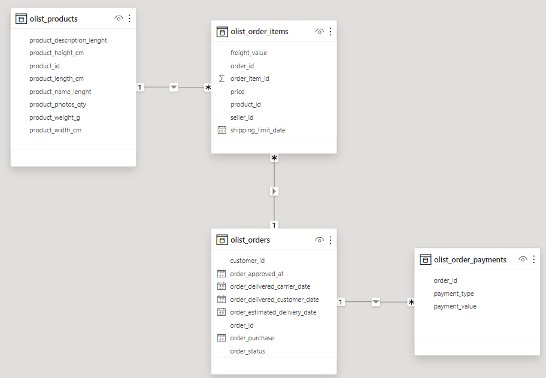

# Olist_project
This repository contains my personal project, which focuses on analyzing datasets generously provided by Olist, the largest department store in Brazilian marketplaces.
I aimed to showcase links between the data and uncover trends in it.

Here's how it's structured:
- firstly, I created the set of tables using PostgreSQL based on the schema (visualization made in PowerBI):

And here's what the tables look like:
# olist_products

# olist_order_items

# olist_orders

# olist_order_payments

- secondly, I asked certain questions, which I later answered using SQL code:

If You have any comments or recommendations, please do not hesitate to let me know.
Thanks for reading this and I hope You will appreciate my work!

