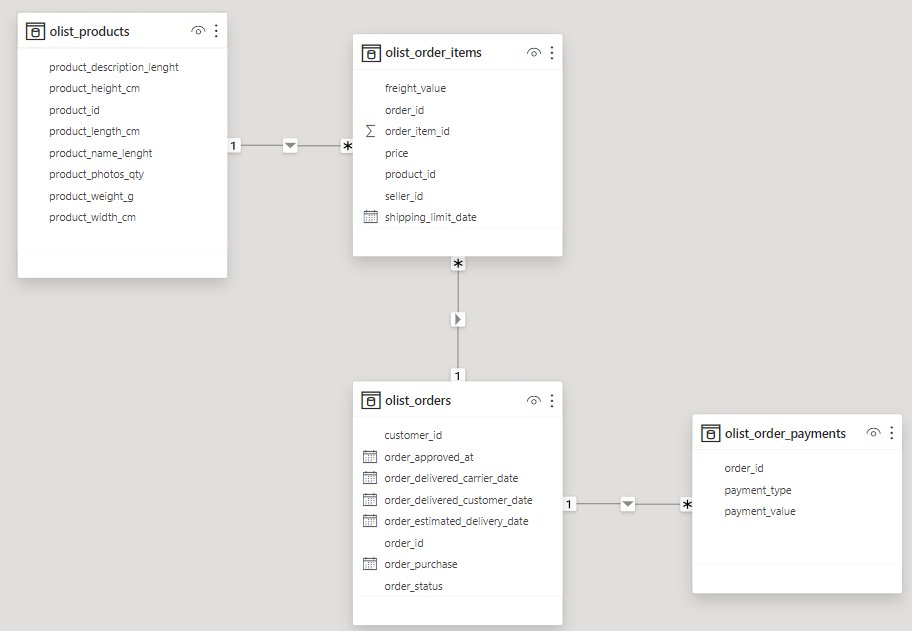
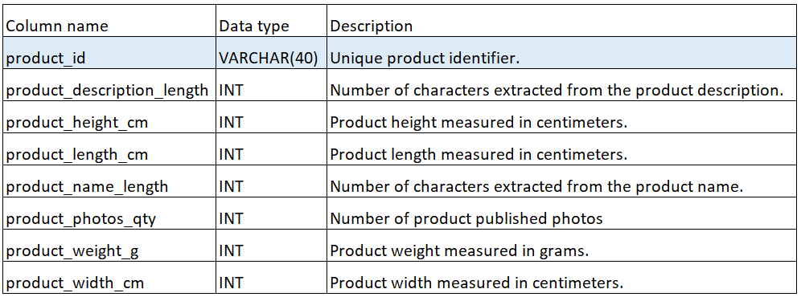
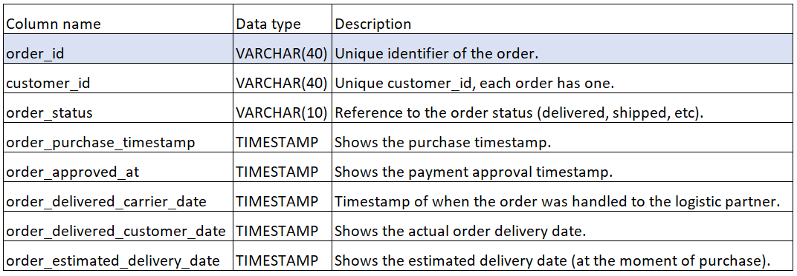
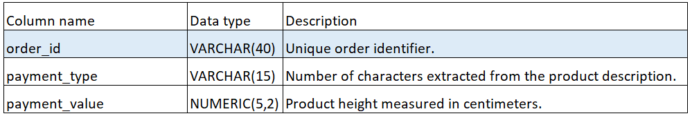

# Olist_project
This repository contains my personal project, which focuses on analyzing datasets generously provided by Olist, the largest department store in Brazilian marketplaces. I grew a personal interest in it, as performing analysis on real commercial data seemed like a great way to work with commercial data.

Here's how the database is structured:
- firstly, I created the set of tables using PostgreSQL based on the schema (visualization made in PowerBI):

And here's what the tables look like:
# olist_products

# olist_order_items

# olist_orders

# olist_order_payments

- secondly, I asked certain questions, which I later answered using SQL code. With these questions, I tried to emulate the real work environment of a data analyst working for Olist.
In the project_tables file, I entered only a fraction of the data into the tables, just to showcase their structure without entering an enormous amount of strings and numbers in them. Of course, in my analysis I used the entire dataset which can be found here:
https://www.kaggle.com/datasets/olistbr/brazilian-ecommerce

# Conclusions

All of the given questions were answered and the project was successful!!! 

If You have any comments or recommendations, please do not hesitate to let me know.
Thanks for reading this and I hope You will appreciate my work!

