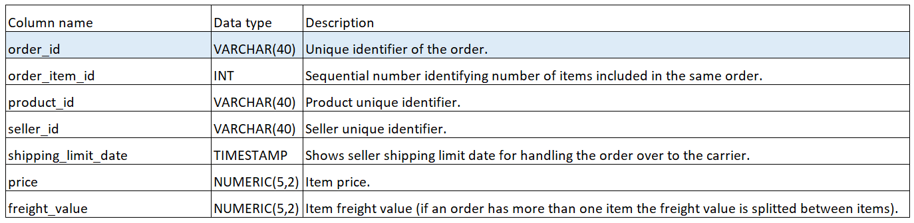

# Olist_project
This repository contains my personal project, which focuses on analyzing datasets generously provided by Olist, the largest department store in Brazilian marketplaces.
I aimed to showcase links between the data and uncover trends in it.

Here's how it's structured:
- firstly, I created the set of tables using PostgreSQL based on the schema (visualization made in PowerBI):

And here's what the tables look like:
# olist_products

# olist_order_items

# olist_orders

# olist_order_payments

- secondly, I asked certain questions, which I later answered using SQL code. With these questions, I tried to emulate the real work environment of a data analyst working for Olist.
In the code file, I entered only a fraction of the data into the tables, just to showcase their structure without entering an enormous amount of strings and numbers in them. Of course, if you want to use the entire dataset, here's a link to CSV files:
https://www.kaggle.com/datasets/olistbr/brazilian-ecommerce

If You have any comments or recommendations, please do not hesitate to let me know.
Thanks for reading this and I hope You will appreciate my work!

